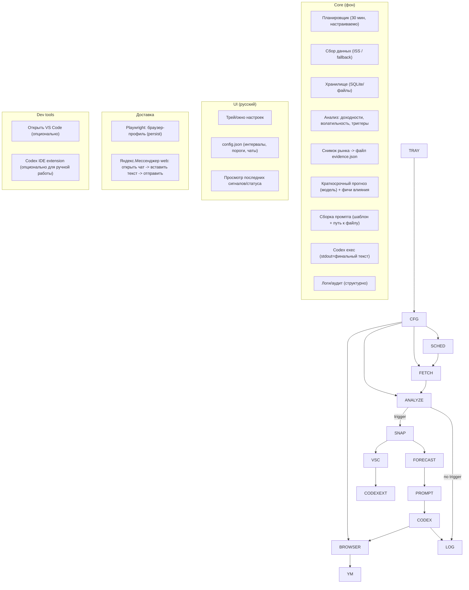

# Windows 11 приложение для мониторинга валют, нефти и золота с аналитикой через Codex и доставкой уведомлений в Яндекс.Мессенджер

## Executive summary

Цель — локальное приложение под Windows 11, которое раз в 30 минут собирает котировки (USD/RUB, CNY/RUB, нефть Brent, золото), считает изменения/волатильность, фиксирует «снимок рынка» в файл при росте волатильности или при движении цены на ±1% и более, затем инициирует генерацию аналитики/краткосрочного прогноза через Codex (без прямого вызова GPT API), и отправляет результат в Яндекс.Мессенджер через автоматизацию браузера. Частота опроса у вас задана как 30 минут; оставляем настраиваемой (по умолчанию 30 минут).

Оптимальная практическая связка для устойчивости (минимум brittle‑UI‑автоматизации) выглядит так:

1. первичный рынок‑датасорс — ISS API Московской биржи (официальный источник торговых данных по FX и срочному рынку; поддерживает JSON/CSV/XML/HTML и имеет режим с задержкой без подписки);
2. «математика» и детект событий — внутри приложения (роллинг‑волатильность + роллинг‑регрессия/ARIMAX‑подобная модель для объяснения влияния нефти/золота на валюты и краткосрочного прогноза);
3. текстовая аналитика — запускается не через API, а через Codex в «non‑interactive» режиме `codex exec`, который отдаёт финальное сообщение в stdout (а прогресс — в stderr), что удобно для автоматизации и логирования; при необходимости параллельно открываем VS Code для визуального контроля (строго по вашему сценарию), но не делаем критически важным получение ответа «из UI панели», потому что это самый хрупкий участок;
4. доставка в Яндекс.Мессенджер — Playwright с persistent‑контекстом (сохранённая сессия), с селекторами, полученными через Playwright codegen. citeturn14view2turn2view2turn25view1turn25view0turn1view3turn18view2turn16search5turn16search0

Ключевые риски — лицензирование/доступность котировок (у ISS без авторизации есть задержка и ограничения на стаканы/историю), возможные блокировки/капчи при браузер‑автоматизации мессенджера, и безопасность токенов/сессий. Для каждого риска ниже даны способы смягчения. citeturn14view2turn12search2turn21view1turn1view2

## Источники данных и форматы

Ниже — рекомендуемые источники (приоритет: первичные/официальные). Для вашего кейса «один провайдер закрывает почти всё» — это ISS API Московской биржи: валютные пары (например, USDRUB\_TOM, CNYRUB\_TOM) и инструменты срочного рынка по Brent и золоту. citeturn23view0turn23view1turn9view3turn9view4turn14view2turn2view2

### Рекомендуемый список (с оценкой надёжности и форматами)

|Данные|Рекомендуемый источник|Почему это «первичный/надёжный»|Доступ/задержка|Форматы|Надёжность (1–5)|Риски/заметки|
|-|-|-|-|-|-:|-|
|USD/RUB, CNY/RUB (интра‑дэй)|entity\["organization","Московская биржа","stock exchange russia"] ISS (движок валютного рынка) + торговые коды вроде USDRUB\_TOM, CNYRUB\_TOM|Торговые данные биржи; ISS — официальный программный интерфейс к рыночным данным|Без авторизации: отдаёт данные с \~15‑мин задержкой и часть данных недоступна (в частности стаканы/история); с подпиской/аутентификацией — полнота выше|XML/CSV/JSON/HTML; формат задаётся расширением в URL|5|Нужно заранее принять, что без подписки будет задержка; при интервале 30 минут это часто приемлемо, но реакции будут позднее. citeturn14view2turn2view2turn5search7turn5search8|
|Нефть Brent (цена)|MOEX: фьючерс на нефть Brent (код BR/BRM)|Спецификация инструмента и котировка публикуются биржей; котировка в USD за баррель|Аналогично ISS: задержка/доступ зависят от режима|Через ISS: XML/CSV/JSON/HTML|5|Это фьючерсная цена (не «спот»), возможна базисная разница; но для «влияния нефти на рубль» часто достаточно как прокси. citeturn9view3turn14view2|
|Золото (цена)|MOEX: контракты GOLD/GD (и др. драгоц. металлы)|Биржевые инструменты; у контрактов есть спецификации и кодовая система|Аналогично ISS|Через ISS: XML/CSV/JSON/HTML|5|Также фьючерсы/биржевой инструмент, не «LBMA spot», но надёжен как торговый индикатор. citeturn9view4turn23view2turn14view2|
|Курсы «официальные» (daily reference)|entity\["organization","Банк России","central bank russia"] (ежедневные курсы/учётные цены)|Официальный регуляторный источник; годится для daily‑сверки, но не для 30‑мин мониторинга|Обычно «раз в день»|SOAP‑сервис (DailyInfo.asmx) возвращает XML‑dataset|5|Это не потоковая/интра‑дэй цена. Хорошо как fallback/валидация. citeturn1view5turn1view6|
|Международные альтернативы (если нужен «глобальный» бенчмарк)|entity\["company","CME Group","derivatives exchange us"] (золото), entity\["organization","ICE Futures Europe","derivatives exchange london"] (Brent)|Крупные международные площадки по деривативам|Обычно платно/ограничено; публичные данные могут быть задержаны|API/лицензируемые фиды|4–5|Для «официальности» подходят, но доступ/стоимость/лицензии могут быть тяжелее, чем MOEX‑подход. citeturn7search10turn6search1|

### Что важно заранее зафиксировать (у вас «не указано», поэтому предлагаются варианты)

**База сравнения для ±1%** (не указано):

* Вариант по умолчанию (простой): сравнивать текущую цену с ценой прошлого опроса (30 минут назад).
* Вариант «для трейдера»: сравнивать с ценой «последнего сигнала» (якорь), чтобы не спамить при тренде.
* Вариант «сессионный»: сравнивать с дневным открытием/закрытием (требует определения торговой сессии).

**Тип цены** (не указано): last / mid / best bid/ask. Для устойчивости анализа обычно берут last (если ликвидность высокая) и/или mid из best bid/ask (если доступно). Доступность стакана без подписки ограничена. citeturn14view2turn2view2

## Архитектура и потоки данных

Ниже архитектура, отражающая ваш сценарий: 30‑мин опрос → детект волатильности/±1% → сохранение файла → запрос аналитики через Codex (инициация «через чат/агент» без прямого API) → отправка в Яндекс.Мессенджер через автоматизированный браузер → логирование/аудит.

Ключевые проектные решения для устойчивости:

* **Разделить “core‑pipeline” и UI**: core работает как сервис/worker, UI — как настройки/трей‑иконка. Для Windows это естественно реализуется через Worker Service в .NET или через планировщик задач + долгоживущий процесс в Python. citeturn13search0turn13search6turn13search7
* **Отдельный “Evidence file”**: при событии сохраняем JSON (или CSV) со всеми рядами и вычисленными фичами. Это делает запрос к Codex воспроизводимым.
* **Не завязывать получение ответа Codex на чтение UI VS Code**: вместо хрупкого “скопируй из боковой панели” использовать `codex exec`, который выдаёт финальное сообщение в stdout и поддерживает JSONL‑режим. VS Code можно всё равно открывать «параллельно» для контроля. citeturn25view1turn25view0



Связанные технические ограничения/возможности:

* ISS поддерживает несколько форматов ответа (XML/CSV/JSON/HTML) и различает режимы доступа: без авторизации часть данных недоступна, а оставшаяся выдаётся с задержкой; аутентификация описана в developer manual. citeturn14view2
* В ISS по конкретному инструменту доступны endpoints для свечей (`/candles`) и др., что удобно для 30‑мин агрегации/истории. citeturn2view2
* Codex IDE extension на Windows имеет экспериментальную поддержку; для лучшего опыта рекомендован WSL2‑workspace и/или настройка “run in WSL”. citeturn1view3turn18view2

## Алгоритмы влияния нефти/золота и краткосрочного прогноза

Ниже — «математический минимум», который реально работает в задачах мониторинга и объяснения сигналов, особенно при вашей частоте (30 минут). Цель не «предсказать рынок идеально», а:

1. детектировать существенные движения/рост волатильности;
2. дать интерпретируемую оценку вклада нефти и золота;
3. сформировать краткосрочный прогноз на 1–2 шага (30–60 минут) с доверительным интервалом и оговорками.

### Нормализация рядов и доходности

Пусть (P^U\_t) — цена USDRUB (руб. за 1 USD), (P^C\_t) — CNYRUB (руб. за 1 CNY), (P^O\_t) — Brent (USD/баррель), (P^G\_t) — золото (USD/oz).

Используем лог‑доходности (устойчивее к масштабу):  
\[
r^X\_t = \\ln\\left(\\frac{P^X\_t}{P^X\_{t-1}}\\right)
]
где (X \\in {U, C, O, G}).

Если вам нужен именно «RUB–USD» как USD за 1 RUB, берём инверсию:  
\[
P^{RUBUSD}\_t = \\frac{1}{P^U\_t}, \\quad r^{RUBUSD}\_t = -r^U\_t
]
аналогично для RUB–CNY.

### Детект «±1% или более»

Процентное изменение за шаг (30 минут) в обычной шкале:
\[
\\Delta%*t = \\left(\\frac{P\_t}{P*{t-1}} - 1\\right)\\cdot 100
]

Триггер: (|\\Delta%\_t| \\ge 1%). Поскольку база сравнения «не указана», это значение делается настройкой (см. выше).

Практичное анти‑дребезжание (cooldown): не больше 1 уведомления на инструмент за N минут, либо пока цена не вернётся в коридор.

### Детект «рост волатильности»

При шаге 30 минут достаточно **реализованной волатильности** на окне последних (n) наблюдений:

\[
\\sigma\_{short}(t)=\\sqrt{\\frac{1}{n-1}\\sum\_{i=t-n+1}^{t} (r\_i-\\bar r)^2}
]
и базовая «длинная» волатильность на большем окне (m) (например, 1–2 недели данных в 30‑мин шагах):
\[
\\sigma\_{long}(t)=\\sqrt{\\frac{1}{m-1}\\sum\_{i=t-m+1}^{t} (r\_i-\\bar r)^2}
]

Критерий «волатильность повышается» (один из устойчивых вариантов):
\[
\\frac{\\sigma\_{short}(t)}{\\sigma\_{long}(t)} \\ge k
]
где (k) обычно 1.5–2.5 и подбирается на истории.

Если вы хотите больше «финансовой теории», можно добавить GARCH‑семейство, но при частоте 30 минут профит часто минимален относительно простого ratio‑подхода; GARCH более оправдан для минутных/тик‑данных (и требует тщательных предположений). citeturn8search35turn8search3

### Оценка влияния нефти/золота на валюты (интерпретируемо)

Есть две ключевые идеи из макро/эмпирики:

* Для экспортёров нефти/сырья изменения цен на нефть часто связаны с динамикой реального эффективного курса (через термины торговли и валютные потоки), но связь нестабильна и “переламывается” политикой/контролями. citeturn27view1turn26view0
* Для России в ряде работ подчёркивается значимость нефти для курсовой динамики и поведения макропеременных/обменного курса (как минимум через роль нефти в экономике и реакцию политики). citeturn26view3turn26view2
* По золоту часто обсуждается роль «хеджа против слабого доллара» и «убежища», но эффект также режимозависим. citeturn9view2turn8search5

Практичный расчёт влияния для мониторинга: **роллинг‑регрессия доходностей валюты на доходности нефти/золота**:

Для USDRUB:
\[
r^{U}*t = \\alpha + \\beta*{O}, r^{O}*{t-\\ell\_O} + \\beta*{G}, r^{G}*{t-\\ell\_G} + \\phi, r^{U}*{t-1} + \\varepsilon\_t
]

Для CNYRUB аналогично:
\[
r^{C}*t = \\alpha' + \\beta'*{O}, r^{O}*{t-\\ell\_O} + \\beta'*{G}, r^{G}*{t-\\ell\_G} + \\phi', r^{C}*{t-1} + \\varepsilon'\_t
]

Где (\\ell\_O, \\ell\_G) — лаги (обычно 0–2 шага при 30‑мин интервале).  
Оценивание — OLS или ridge (желательно ridge при малых окнах).

Интерпретация вклада в текущем шаге:
\[
contrib\_O = \\hat\\beta\_O , r^O\_{t-\\ell\_O},\\quad
contrib\_G = \\hat\\beta\_G , r^G\_{t-\\ell\_G},\\quad
contrib\_{FXmom}=\\hat\\phi, r^U\_{t-1}
]
И «доля объяснённого» как (R^2) или отношение вклада к (\\hat r^U\_t).

Замечание про устойчивость: коэффициенты могут «переворачиваться» (структурные разрывы), поэтому:

* учить модель на роллинг‑окне (например, 10–30 торговых дней) и дополнительно держать EWMA‑сглаживание коэффициентов;
* выдавать в уведомлении качество (например, (R^2) и/или MAE на последнем окне) и помечать низкую надёжность прогноза.

### Краткосрочный прогноз

Для горизонта 30–60 минут рациональны два уровня:

**Уровень 1 (детерминированный, быстрый):** прогнозировать следующий шаг доходности по формуле выше:
\[
\\hat r^{U}*{t+1} = \\hat\\alpha + \\hat\\beta*{O}, r^{O}*{t} + \\hat\\beta*{G}, r^{G}*{t} + \\hat\\phi, r^{U}*{t}
]
\[
\\hat P^{U}*{t+1} = P^{U}*{t}\\cdot e^{\\hat r^{U}\_{t+1}}
]

Доверительный интервал можно аппроксимировать через стандартное отклонение остатков (\\hat\\sigma\_\\varepsilon) на окне и выбрать, например, (\\pm 1.64 \\hat\\sigma\_\\varepsilon) для \~90% (условно‑нормальная аппроксимация).

**Уровень 2 (чуть “научнее”):** SARIMAX/ARIMAX (ARIMA + экзогенные факторы).

* В Python это делается стандартными библиотеками (см. план реализации).
* В .NET прямой ARIMAX реже «из коробки», поэтому обычно берут: (а) регрессию + AR‑ошибка, или (б) ML.NET SSA как baseline для univariate‑прогноза (без экзогенов) и отдельно показывают вклад нефти/золота как объясняющие факторы. SSA описывается как метод декомпозиции и прогнозирования временного ряда. citeturn15search0turn15search38

Здесь важно: **прогноз как число/диапазон генерирует алгоритм**, а **текстовую интерпретацию и “человеческий” прогноз‑комментарий** вы инициируете через Codex запросом, передавая файл со всеми фичами и результатами — это соответствует вашему требованию «прогнозы генерирует модель/алгоритм, но инициируются запросом в чат/агент». citeturn25view1turn25view0

## План реализации в VS Code

Ниже два варианта (как вы просили). Рекомендованный — .NET (надёжнее на Windows как сервис/фон, проще деплой, Playwright‑интеграция зрелая), альтернативный — Python (быстрее итерации и богаче по тайм‑сериям). В обоих вариантах не используется OpenAI API напрямую: Codex вызывается через установленный Codex CLI/IDE extension и режим `codex exec`. citeturn25view1turn25view0turn1view4turn17search11

### Вариант A (альтернатива): Python

**Когда выбирать:** максимальная скорость разработки, богатая экосистема для статистики (SARIMAX), удобная работа с данными.

**Библиотеки:**

* HTTP: `httpx` или `requests` (стандартно).
* Данные/математика: `numpy`, `pandas`.
* Модели: `statsmodels` (SARIMAX) или `scikit-learn` (ridge regression).
* GUI/настройки: `PySide6` или минимально `pystray` + JSON конфиг.
* UI‑автоматизация Windows (если всё же нужно управлять VS Code панелью): `pywinauto` (Win32/UIA). citeturn13search9turn13search25
* Браузер‑автоматизация: `playwright` (Python binding). citeturn11search1turn16search5turn16search1
* Упаковка: PyInstaller (one‑file возможно). citeturn13search1turn13search24turn13search8

**Структура проекта (пример):**

```text
marketwatch/
  app.py
  config.json
  core/
    scheduler.py
    sources/
      moex\_iss.py
      cbr\_fallback.py
    analytics/
      returns.py
      volatility.py
      influence.py
      forecast.py
    codex/
      codex\_exec.py
      prompt\_builder.py
    delivery/
      yandex\_messenger\_pw.py
    storage/
      snapshot\_writer.py
      sqlite\_store.py
    logging/
      log\_setup.py
  ui/
    tray.py
    settings\_window.py
  tests/
    test\_influence.py
    test\_triggers.py
```

**Ключевые функции (скелет):**

```python
# core/sources/moex\_iss.py
import httpx

ISS\_BASE = "https://iss.moex.com/iss"

async def fetch\_marketdata\_json(path: str, params: dict) -> dict:
    async with httpx.AsyncClient(timeout=20.0) as client:
        r = await client.get(f"{ISS\_BASE}/{path}.json", params=params)
        r.raise\_for\_status()
        return r.json()

# core/analytics/volatility.py
import numpy as np

def realized\_vol(log\_returns: np.ndarray) -> float:
    if len(log\_returns) < 2:
        return 0.0
    return float(np.std(log\_returns, ddof=1))

def vol\_spike(vol\_short: float, vol\_long: float, k: float) -> bool:
    return vol\_long > 0 and (vol\_short / vol\_long) >= k
```

**План по шагам в VS Code + Codex (Python):**

1. Создать `venv`, поставить зависимости.
2. Реализовать MOEX ISS клиент (JSON) и кеширование. ISS поддерживает JSON/CSV/XML/HTML; формат задаётся расширением в URL. citeturn14view2
3. Реализовать триггеры ±1% и рост волатильности, cooldown.
4. Генерировать `evidence.json` с последними рядами и рассчитанными фичами/коэффициентами.
5. Интегрировать `codex exec` как subprocess (см. ниже) и получать финальный текст из stdout. `codex exec` специально описан как режим для пайплайнов, где финальный ответ отделён от прогресса. citeturn25view1
6. Отправка в Яндекс.Мессенджер через Playwright persistent context. Playwright рекомендует role‑локаторы (`getByRole`) и имеет codegen для генерации устойчивых селекторов. citeturn16search1turn16search0turn16search5
7. Упаковка PyInstaller, запуск по расписанию через Task Scheduler (`schtasks /create /sc minute /mo 30 ...`). citeturn13search7turn13search24

### Вариант B (рекомендованный): C#/.NET (Worker Service + WPF)

**Когда выбирать:** максимально “windows‑native”, устойчивый фон/сервис, аккуратная упаковка и управление жизненным циклом.

**Библиотеки/компоненты:**

* Фон: .NET Worker Service (BackgroundService/IHost). citeturn13search0turn13search6
* Запуск как Windows Service: интеграция описана в документации. citeturn13search2turn13search6
* HTTP: `HttpClient`, JSON: `System.Text.Json`.
* Аналитика:

  * регрессия/линейная алгебра: Math.NET Numerics (есть раздел Regression и namespace LinearRegression). citeturn15search1turn15search37turn15search9
  * baseline‑прогноз (univariate): ML.NET TimeSeries / SSA (как опциональный второй “голос” прогноза). citeturn15search0turn15search38
* Браузер‑автоматизация: Microsoft.Playwright (официальный порт; NuGet). citeturn11search2turn11search17turn11search8
* UI: WPF (русский интерфейс), настройки в `config.json` (избегаем YAML по вашему требованию).
* Планировщик:

  * либо сервис с таймером внутри,
  * либо Task Scheduler как лёгкий вариант (через `schtasks create` для “каждые N минут”). citeturn13search7

**Структура решения (пример):**

```text
MarketWatch.sln
  src/
    MarketWatch.Worker/
      Program.cs
      Worker.cs
      Config/
        config.json
      Sources/
        MoexIssClient.cs
        CbrFallbackClient.cs
      Analytics/
        Returns.cs
        Volatility.cs
        InfluenceRegression.cs
        Forecast.cs
      Codex/
        CodexExecRunner.cs
        PromptBuilder.cs
      Delivery/
        YandexMessengerPlaywright.cs
      Storage/
        SnapshotWriter.cs
        SqliteStore.cs
      Logging/
        SerilogSetup.cs
    MarketWatch.UI/
      App.xaml
      MainWindow.xaml
      ViewModels/
      Resources/Strings.ru-RU.resx
  tests/
    MarketWatch.Tests/
```

**Базовый пример фонового цикла (30 минут, настраиваемо):**

```csharp
// Worker.cs
using Microsoft.Extensions.Hosting;
using Microsoft.Extensions.Logging;

public sealed class Worker : BackgroundService
{
    private readonly ILogger<Worker> \_logger;
    private readonly TimeSpan \_period;

    public Worker(ILogger<Worker> logger /\* + Config \*/)
    {
        \_logger = logger;
        \_period = TimeSpan.FromMinutes(30); // default, configurable
    }

    protected override async Task ExecuteAsync(CancellationToken stoppingToken)
    {
        while (!stoppingToken.IsCancellationRequested)
        {
            try
            {
                // 1) Fetch market data
                // 2) Compute triggers
                // 3) If trigger -> snapshot -> codex exec -> send via Playwright
            }
            catch (Exception ex)
            {
                \_logger.LogError(ex, "Worker loop failed");
            }

            await Task.Delay(\_period, stoppingToken);
        }
    }
}
```

**Почему этот вариант “оптимальный” для Windows 11:**

* Worker Service — стандартный шаблон для долгоживущих процессов; поддерживается CLI и Visual Studio, хорошо ложится на сервисный сценарий. citeturn13search0turn13search6
* Playwright .NET — официальный порт, удобно ставится через NuGet и имеет нативную экосистему тестирования. citeturn11search17turn11search28
* Регрессия и математика закрываются Math.NET; для временных рядов есть ML.NET SSA как baseline. citeturn15search1turn15search0

## Автоматизация: Codex и отправка в Яндекс.Мессенджер

Здесь две части: (A) как инициировать аналитику через Codex так, чтобы это было автоматизируемо и без прямого API; (B) как доставить результат через браузер.

### Codex: практическая автоматизация без API

#### Рекомендуемый путь: `codex exec` (устойчиво для автоматизации)

`codex exec` описан как non‑interactive режим, где **финальное сообщение печатается в stdout**, а прогресс — в stderr; есть JSONL‑режим и опции вывода “последнего сообщения” в файл. Это идеально подходит под “приложение собрала данные → попросила аналитику → получила текст → отправила”. citeturn25view1

Пример команды (идея):

* рабочая директория — ваша папка проекта с data‑файлами,
* промпт — строгий шаблон,
* ограничения прав — оставить read‑only (по умолчанию) или явно. `codex exec` отдельно подчёркивает безопасность и минимальные permissions в automation. citeturn25view1turn18view3

Пример вызова из приложения (псевдо‑код, одинаково для Python/C#):

```text
codex exec --cd "C:\\MarketWatchWorkspace" "Проанализируй файл evidence.json ... сформируй краткосрочный прогноз на 30–60 минут ... ответ на русском"
```

Замечания по безопасности: документация явно говорит рассматривать auth‑файл как пароль и не утекать им. citeturn25view1

#### “Открывать VS Code и Codex extension” — как встроить в ваш сценарий

Вы хотите: «открыть VS Code → в расширении Codex запросить аналитику со ссылкой на файл». Это можно сделать двумя уровнями:

1. **Открытие VS Code на нужной папке/файле** — штатно через CLI `code -r`/`--reuse-window` и `-g`/`--goto`. citeturn19view1
2. **Добавление файла в контекст Codex**: у Codex IDE extension есть команды вроде `chatgpt.addFileToThread`, `chatgpt.newChat`, `chatgpt.openSidebar` и т.п. (командные ID перечислены в документации). citeturn18view0

Практическая проблема: внешнему приложению сложнее “вызвать команду расширения” в уже запущенном VS Code без дополнительной прослойки (своё расширение/макрос). Поэтому для “безотказного” автоматического цикла критическую часть лучше сделать через `codex exec`, а VS Code открывать как **опциональный UI‑контроль** (например, по клику “Открыть последний снимок”).

Отдельно: у Codex IDE extension Windows‑поддержка обозначена как экспериментальная; для лучшего опыта рекомендован WSL2‑workspace, а также есть настройка `chatgpt.runCodexInWindowsSubsystemForLinux` (Windows only), где прямо сказано, что agent mode на Windows требует WSL. citeturn1view3turn18view2

### Яндекс.Мессенджер: сценарий браузер‑автоматизации (Playwright)

Ваше требование — “через автоматизированный браузер” и без официальных GPT API. Это выполняется Playwright‑сценарием.

#### Где открывать веб‑версию

Официальная справка указывает вход через ссылку вида `https://yandex.ru/chat#/`. citeturn21view0

Если вы всё же решите использовать официального бота (не ваш базовый вариант, но важно для сравнения), документация по интеграции показывает формат URL чата и как из него получить `chat\_id`. citeturn21view1

#### Стабильность селекторов: как получить реальные “селекторы под ваш аккаунт”

Playwright рекомендует получать устойчивые локаторы через **codegen**, который “подбирает лучший locator, приоритизируя role/text/testid” и умеет “Pick locator”. Это именно то, что нужно, потому что DOM мессенджера может меняться. citeturn16search0turn16search22turn16search1

#### Капча/авторизация

Автоматическое “обходить капчу” — плохая идея и часто нарушает правила сервисов; вместо этого делается так:

* первый запуск: открыть браузер **в видимом режиме**, вы вручную логинитесь и проходите возможные проверки;
* затем всё работает на **persistent context**, который хранит cookies/localStorage в userDataDir. Playwright умеет `launchPersistentContext(userDataDir)`. citeturn16search5turn16search0  
Если внезапно появляется SmartCaptcha — приложение должно это детектировать и попросить вас вручную подтвердить (SmartCaptcha описан как сервис защиты от ботов). citeturn12search2

#### Пример кода (Python + Playwright) для отправки сообщения

> Это шаблон: реальные локаторы (`getByRole`/`getByPlaceholder`/CSS) вы снимаете через codegen. citeturn16search0turn16search1turn16search5  

```python
from playwright.sync\_api import sync\_playwright
from pathlib import Path

YANDEX\_CHAT\_URL = "https://yandex.ru/chat#/"  # вход/корень

def send\_to\_yandex\_messenger(chat\_url: str, message: str, profile\_dir: str) -> None:
    Path(profile\_dir).mkdir(parents=True, exist\_ok=True)

    with sync\_playwright() as p:
        # Persistent context = сохранение сессии между запусками
        ctx = p.chromium.launch\_persistent\_context(
            user\_data\_dir=profile\_dir,
            headless=False,  # для устойчивости логина/капчи лучше headful
        )
        page = ctx.new\_page()

        page.goto(chat\_url, wait\_until="domcontentloaded")

        # ВАРИАНТ 1: если знаете конкретный URL чата (например /chats/<...>)
        # page.goto("https://yandex.ru/chat/#/chats/<chat\_id>", wait\_until="domcontentloaded")

        # ВАРИАНТ 2: найти чат через поиск (локатор подбирается codegen)
        # page.get\_by\_role("textbox", name="Поиск").fill("Название чата")
        # page.get\_by\_text("Название чата").click()

        # Локатор поля ввода сообщения (подставить реальный из codegen)
        composer = page.get\_by\_role("textbox")  # пример; уточнить
        composer.click()
        composer.fill(message)

        # Кнопка "Отправить" (уточнить локатор)
        page.get\_by\_role("button", name="Отправить").click()

        ctx.close()
```

Почему `getByRole()` — основной подход: Playwright описывает role‑локаторы как наиболее близкие к тому, как пользователи/assistive tech воспринимают страницу, и рекомендует их приоритизировать. citeturn16search1turn16search22

#### Пример кода (C# + Playwright) для отправки сообщения

```csharp
using Microsoft.Playwright;
using System;
using System.Threading.Tasks;

public static class YandexMessengerSender
{
    public static async Task SendAsync(string chatUrl, string message, string userDataDir)
    {
        using var playwright = await Playwright.CreateAsync();
        var context = await playwright.Chromium.LaunchPersistentContextAsync(
            userDataDir,
            new BrowserTypeLaunchPersistentContextOptions
            {
                Headless = false
            });

        var page = await context.NewPageAsync();
        await page.GotoAsync(chatUrl, new PageGotoOptions { WaitUntil = WaitUntilState.DOMContentLoaded });

        // Селекторы заменить на реальные из codegen
        var composer = page.GetByRole(AriaRole.Textbox);
        await composer.ClickAsync();
        await composer.FillAsync(message);

        await page.GetByRole(AriaRole.Button, new() { Name = "Отправить" }).ClickAsync();

        await context.CloseAsync();
    }
}
```

Playwright .NET — официальный порт; типичный паттерн запуска и взаимодействия описан в документации API. citeturn11search2turn16search5

### Шаблон “evidence.json” и промпта к Codex

Минимально полезно сохранять:

* временные метки и цены,
* доходности,
* волатильность short/long,
* событие‑триггер и его параметры,
* коэффициенты влияния (\\beta\_O, \\beta\_G),
* прогноз (число + доверительный интервал),
* “качество модели” (например, MAE на последнем окне, (R^2)).

Промпт к Codex должен быть жёстким и воспроизводимым, например:

* “используй только данные из evidence.json”,
* “дай 3 фактора и их вклад”,
* “прогноз на 30–60 минут, с уверенностью (низкая/средняя/высокая) и причинами”.

В IDE extension можно ссылаться на файлы через `@filename` (если файл в workspace и открыт/доступен). citeturn24view0

### Пример формата уведомления и шаблон аналитики (то, что уйдёт в мессенджер)

```text
📣 Сигнал рынка (30 мин)

Инструмент: USD/RUB (MOEX: USDRUB\_TOM)
Событие: изменение +1.23% за 30 мин (триггер ≥ 1.00%)
Текущая цена: 00.0000  | Пред. опрос: 00.0000
Волатильность: short=0.0048, long=0.0021, ratio=2.29 (триггер ≥ 2.00)

Факторы (оценка влияния на шаг):
• Нефть Brent: r\_oil=+0.60% → вклад: -0.18% к USD/RUB (β\_oil=-0.30)
• Золото: r\_gold=-0.25% → вклад: +0.05% к USD/RUB (β\_gold=-0.20)
• Инерция FX: вклад +0.32% (φ=0.40)
Качество модели (rolling): R²=0.28, MAE=0.35% (окно 20 дней)

Краткосрочный прогноз (30–60 мин):
• База: 00.0000 → прогноз: 00.0000 (Δ ≈ +0.20%)
• ДИ(≈90%): \[00.0000; 00.0000]
Уверенность: средняя (волатильность повышена, R² умеренный)

Комментарий:
— (текст от Codex: кратко, 6–10 строк, без “советов”, но с вероятностным сценарием)

Источник: MOEX ISS (возможна задержка данных)
```

(Цены/числа — пример; реальные подставляются из ваших расчётов.)

## Тестирование, развёртывание и риски

### План тестирования

**Unit‑тесты (быстро, дешево):**

* расчёт доходностей, процентов, волатильности short/long;
* триггеры ±1% и ratio‑vol;
* регрессия влияния: проверка знаков/стабильности на синтетике (например, когда oil влияет отрицательно на USDRUB);
* сериализация `evidence.json` и гарантия схемы (версионирование).

**Интеграционные тесты:**

* ISS клиент: мок‑ответы JSON/ошибки/таймауты; ISS поддерживает несколько форматов, но в коде лучше фиксировать JSON как основной. citeturn14view2
* Codex runner: тест “процесс стартует, stdout не пустой/JSONL валиден”; `codex exec` описывает разделение stdout/stderr и JSONL события. citeturn25view1
* Browser automation: прогон Playwright на headful режиме; селекторы снять через codegen; затем регрессионные прогоны. citeturn16search0turn16search1

**E2E (реальный контур):**

* развернуть на тестовом чате, отправлять тест‑сообщения;
* проверять сценарии “истекла сессия → нужно залогиниться”, “появилась капча → ручная пауза”, “чат не найден → fallback на поиск/ошибку”.

### Развёртывание на Windows 11

Есть два устойчивых пути:

1. **Windows Service** (рекомендуемо для .NET): Worker Service, зарегистрированный как служба, автозапуск, восстановление после падений. Документация описывает хостинг Worker Service как Windows Service. citeturn13search2turn13search6
2. **Task Scheduler** (просто и прозрачно): запускать exe каждые 30 минут. Команда `schtasks /create` поддерживает режим “каждые N минут” (MINUTE). citeturn13search7

Для Python‑варианта упаковка в exe через PyInstaller; one‑file режим официально поддержан, но имеет особенности по старту/ресурсам. citeturn13search24turn13search8

### Риски и смягчение

**Правовые/лицензионные (данные):**

* Риск: рыночные данные могут иметь условия использования (особенно real‑time). В ISS без авторизации часть данных не доступна, а доступные — с задержкой; для real‑time может потребоваться подписка/аутентификация. Смягчение: явно включить в UI “режим задержки”, поддержать ключ/логин для подписки, вести аудит источника в каждом уведомлении. citeturn14view2

**Надёжность данных/устойчивость моделей:**

* Риск: связь нефти/золота с валютами нестабильна, зависит от режима, политики и структурных разрывов. Смягчение: роллинг‑оценка, метрики качества в сообщении, флаг “низкая уверенность”, несколько окон (короткое/длинное), fallback на чисто “volatility/price move alert” без причинности. Общая эмпирика связи нефти и реального курса для экспортёров обсуждается в работах ЕЦБ; для России — нефть фигурирует как значимый фактор макро‑динамики/курса в исследованиях и моделях ERER. citeturn26view0turn27view1turn26view2turn26view3

**Блокировки/капча/антибот (мессенджер):**

* Риск: web‑интерфейс может включать SmartCaptcha (защита от ботов), селекторы меняются, headless может детектиться. Смягчение: persistent context + headful, минимальная “человеческая” скорость, codegen‑локаторы, ручное подтверждение при капче, и “план Б” (официальный Bot API) для критических уведомлений. SmartCaptcha описана как сервис защиты от ботов и автоматизированных атак. citeturn12search2turn16search0turn16search5

**Безопасность (учётки/токены):**

* Если вы используете Bot API: токен бота нужно хранить безопасно; в справке подчёркивается “сохраните токен в надёжном месте”, и есть ограничения — бот работает в рамках организации. citeturn21view1turn12search3turn1view2
* Если вы используете `codex exec`: auth‑файл рассматривается как пароль; нельзя коммитить и утекать. citeturn25view1
* Для browser‑automation: профиль (cookies/localStorage) — это тоже секрет; хранить в каталоге с ограниченными ACL, не синхронизировать в облака.

### Таблица сравнения доставки уведомлений

|Критерий|Яндекс-чат через браузер (Playwright)|Официальные API мессенджеров|
|-|-|-|
|Надёжность|Средняя: зависит от UI/DOM, возможны капча/изменения интерфейса|Высокая при корректной реализации; контракт API стабильнее|
|Сложность реализации|Средняя–высокая: нужно поддерживать селекторы, сессию, восстановление логина; помогает codegen|Средняя: нужно разобраться с OAuth/токенами и форматами запросов|
|Безопасность|Риск утечки cookie‑профиля; риск “automation detected”; сложнее строгий контроль|Лучше контролируется: токены/секреты можно хранить штатно, ограничивать права|
|Соответствие правилам|Потенциально спорно: UI‑автоматизация может нарушать условия сервиса|Обычно лучше: это “официальный” путь|
|Характеристика для Яндекс.Мессенджера|Работает в web‑версии (`yandex.ru/chat#/`), но возможны SmartCaptcha|Bot API есть для Яндекс 360 бизнеса; есть ограничения “только участники организации”, метод sendText и формат chat\_id описаны официально|

Факты по Bot API: endpoint отправки текста и ограничения видны в официальной документации, а также показан формат chat\_id, который извлекается из URL чата. citeturn1view1turn21view1turn12search3

