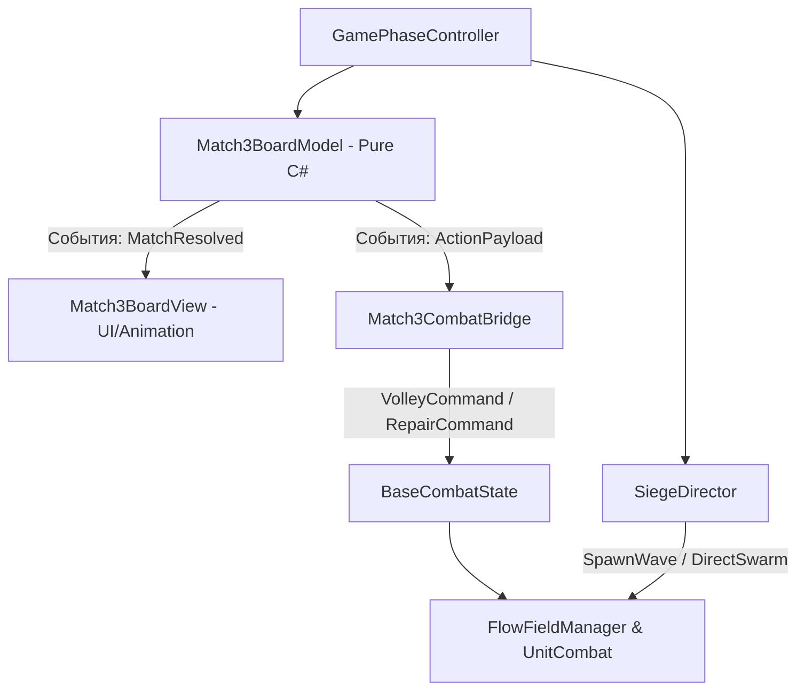

# Master Game Design Document: «Колония: Осада» (Colony Siege: Match-3 Survival)

> **Статус документа:** Canonical Master GDD & System Architecture  
> **Версия:** 2.0.0 (Approved Architecture & Pacing Pivot)  
> **Целевая платформа:** Яндекс Игры (WebGL 2.0, Canonical Viewport 9:16)  
> **Целевая экономика:** 30 000 ₽ / месяц (~1 000 ₽ / день при ~1 500 DAU, гипотеза ARPU 0.60–0.70 ₽)  
> **Главный репозиторный якорь:** [docs/gameplay_current_state.md](../../docs/gameplay_current_state.md)

---

## 1. High Concept и философия проекта

### 1.1 Суть игры
**«Колония: Осада»** — это гибрид симулятора выживания колонии и адреналинового экшена в реальном времени, где **каждое действие на поле боя управляется комбинациями на сетке «три в ряд»**.

Центральное ядро игры — **мгновенная и наглядная причинно-следственная связь**:
> Свайп внизу -> немедленный залп наверху -> орда мутантов спотыкается под огнем -> стена под угрозой -> игрок лихорадочно ищет следующую комбинацию.

### 1.2 Обоснование пивота
* Прежний процедурный мир (810 чанков, потоковая подгрузка, far-view запекание, микроконтроль 20 клавишами) заморожен из-за тупика по производительности в WebGL (14 FPS на зуме, долгая загрузка).
* Мы сохраняем и переиспользуем проверенные ассеты и системы:
  - Боевой движок стрельбы и урона [UnitCombat.cs](../../My%20project/Assets/Scripts/Presentation/View/UnitCombat.cs).
  - Алгоритм плотной толпы [FlowFieldManager.cs](../../My%20project/Assets/Scripts/Presentation/Pathfinding/FlowFieldManager.cs) и расталкивание [LocalAvoidanceSystem.cs](../../My%20project/Assets/Scripts/Presentation/Performance/LocalAvoidanceSystem.cs).
  - Спрайты солдат, оружия, мутантов и тайлсетов базы из `Assets/Sprites/Imported`.
* Вся игра упаковывается в ультра-доступный интерфейс «три в ряд», понятный любому браузерному игроку, но дающий глубокий тактический адреналин.

---

## 2. Экранная архитектура (Canonical 9:16 Viewport)

Для первой версии фиксируется **строго единый геймплейный лейаут 9:16** на всех платформах:

```
┌─────────────────────────────────────────────────────────┐
│                    ВЕРХНИЙ ЭКРАН (~44–46%)              │
│                 АРЕНА БОЯ / СИМУЛЯЦИЯ БАЗЫ              │
│                                                         │
│   [Казарма] [Вышка]           [Стена базы]    [Орда]    │
│      🏢        🗼                  🚧         🧟🧟🧟    │
│   Стрелки на позициях         HP: 850/1000   Наступают  │
│   (RTS-симуляция в реале)     Таймер: 0:42   в реале    │
├─────────────────────────────────────────────────────────┤
│                    НИЖНИЙ ЭКРАН (~54–56%)               │
│                  АКТИВНАЯ ДОСКА MATCH-3 (7x7)           │
│                                                         │
│   [ 🔴 ] [ 🔵 ] [ 🟡 ] [ 🟢 ] [ 🟣 ] [ 🔴 ] [ 🔵 ]      │
│   [ 🔵 ] [ 🟡 ] [ 🟢 ] [ 🟣 ] [ 🔴 ] [ 🔵 ] [ 🟡 ]      │
│   [ 🟡 ] [ 🟢 ] [ 🟣 ] [ 🔴 ] [ 🔵 ] [ 🟡 ] [ 🟢 ]      │
│   Сетка 7x7. Размер клеток, свайп и HUD идентичны везде │
└─────────────────────────────────────────────────────────┘
```

### 2.1 Правила адаптации Desktop и Mobile
* **Mobile (75%+ аудитории Яндекса):** Родной вертикальный экран 9:16 на весь экран смартфона. Палец снизу комфортно достает до клеток и не заслоняет поле боя.
* **Desktop (ПК-браузер):** Тот же самый вертикальный viewport 9:16 центрируется посередине экрана. Никакого отдельного side-by-side режима в V1, чтобы не создавать второй интерфейс с отдельным балансом и сбитой мышечной памятью. Свободные боковые зоны отдаются под декоративный арт базы, лог событий и расширенную статистику.

---

## 3. Макро-цикл: День, Закат, Ночь, Рассвет

Игра строится на коротком, выверенном цикле смены фаз:

```
┌─────────────────┐       ┌─────────────────┐       ┌─────────────────┐       ┌─────────────────┐
│   ДЕНЬ (МИР)    │ ────> │   ЗАКАТ (DUSK)  │ ────> │   НОЧЬ (ОСАДА)  │ ────> │ РАССВЕТ (DAWN)  │
│  15–25 ходов    │       │     2–3 сек     │       │    60–90 сек    │       │     Экраны      │
│ Подготовка базы │       │ Сирена, тревога │       │ Полный реалтайм │       │  Upgrade / Наград
└─────────────────┘       └─────────────────┘       └─────────────────┘       └─────────────────┘
```

### 3.1 Фаза «День» (Короткая подготовка, ограничение по ходам)
* **Принцип:** Это не отдельная медленная игра, а короткая фаза снаряжения перед боем (45–60 секунд).
* **Механика ограничения:** Строго **ограниченное число ходов (15–25 ходов)**, без таймера. Игрок спокойно изучает доску и планирует экономические комбинации без стресса.
* **Результат фазы:** Сбор очков ремонта стены, накопление патронов и найм стрелков на вышки.

### 3.2 Фаза «Ночь» (Осада в чистом реальном времени)
* **Принцип:** Никаких очередей ходов, время не ждет. Длительность ночи — **60–90 секунд** (до 120 сек на босс-волнах).
* **Давление:** Орда мутантов спавнится волнами через `FlowFieldManager` и бежит к стене. Если игрок не собирает комбинации — гарнизон не стреляет, стена ломается.
* **Правило разрешения анимаций (Анти-фриз):**
  - Расчет комбинаций в логике (`Match3BoardModel`) происходит мгновенно (< 5 мс).
  - Бюджет анимации падения и растворения фишек — **200–350 мс**.
  - Игроку разрешается **буферизовать следующий свайп** или выполнять ход до полного завершения фонового каскада.
  - Боевая симуляция наверху **никогда не останавливается на время анимации фишек**. Ситуация «animation lock = defeat» категорически запрещена.

---

## 4. Пять цветовых семейств токенов (Единая концепция)

Игрок не должен учить 10 разных иконок. Фиксируются **пять постоянных цветов**, семантика которых сохраняется в обеих фазах:

| Цвет | Семантическая область | Фаза «День» (Снаряжение) | Фаза «Ночь» (Реалтайм бой) |
| :---: | :--- | :--- | :--- |
| 🔴 **Красный** | **Огневая мощь / Оружие** | Производство патронов / Закупка винтовок | **Залп стрелков:** одновременный огонь по передовой |
| 🔵 **Синий** | **Защита / Фортификация** | Заготовка бетона / Рост макс. HP стены | **Ремонт стены:** мгновенные +HP и щит на 2 сек |
| 🟡 **Желтый** | **Технологии / Металл** | Детали турелей / Энергосети | **Электрошок:** стан/удар током по проволоке перед стеной |
| 🟢 **Зеленый** | **Личный состав / Медицина** | Провизия / Найм дополнительных стрелков | **Аптечка:** лечение раненых бойцов, бафф скорострельности |
| 🟣 **Пурпурный** | **Командование / Тактика** | Чертежи / Редкие ресурсы лаборатории | **Точечный фугас:** выстрел снайпера по самой сильной цели |

---

## 5. Система Power-Up комбинаций

При сборе больше 3 фишек в ряд создаются боевые модификаторы:

1. **4 в ряд -> 🚀 Ракета / Пулеметный прострел (Line Clear):**
   - На доске: уничтожает весь ряд или колонку.
   - В бою: с вышки запускается реактивная граната / турель дает длинную очередь по прямой, прошивая толпу насквозь.
2. **L / T-образная форма -> 💣 Граната / Динамит (Radial Blast):**
   - На доске: взрывает область 3х3 клетки.
   - В бою: бросок гранаты в эпицентр скопления мутантов (радиальный AOE-урон с разлетом тел).
3. **5 в ряд -> 📡 Рация Авиаудара (Color Clear):**
   - На доске: уничтожает все фишки выбранного цвета.
   - В бою: ковровый бомбовый удар напалмом по всей ширине линии соприкосновения.

---

## 6. Бестиарий и поведение орды (Reusing FlowField & UnitCombat)

Враги используют готовую симуляцию [FlowFieldManager.cs](../../My%20project/Assets/Scripts/Presentation/Pathfinding/FlowFieldManager.cs) и движок боя [UnitCombat.cs](../../My%20project/Assets/Scripts/Presentation/View/UnitCombat.cs):

| Тип мутанта | Скорость / HP | Роль в штурме | Тактическое противодействие |
| :--- | :--- | :--- | :--- |
| **Ходок (Walker)** | Низкая / Среднее | Массовое пушечное мясо, давит числом | Красные залпы (🔴), ракеты (🚀) |
| **Бегун (Runner)** | Высокая / Низкое | Прорыв во фланг, прыжки на баррикаду | Желтый электрошок (🟡), штыки |
| **Громила (Brute)** | Медленный / Высокое | Таран стены, наносит тяжелые удары | Пурпурный фокус (🟣), динамит (💣) |
| **Ночной Босс** (каждые 5 дней) | Огромное HP | Спец-атаки, дебаффы доски (зараженные клетки) | Рация авиаудара (📡), тактический концентрированный огонь |

---

## 7. Структура кампании: 6 Глав с чекпоинтами

Чтобы не отпугивать казуальную аудиторию Яндекс Игр безжалостным сбросом на Day 1 после 25 дней игры, вводится блочная система прогрессии:

* **Кампания разбита на 6 Глав по 5 дней:**
  - Глава 1: Дни 1–5 (Застава у леса, обучение, легкие волны).
  - Глава 2: Дни 6–10 (Пригород, появление Бегунов).
  - Глава 3: Дни 11–15 (Заводской сектор, Громилы).
  - Глава 4: Дни 16–20 (Промзона, кислотные мутанты).
  - Глава 5: Дни 21–25 (Бункерный комплекс, ночные штормы).
  - Глава 6: Дни 26–30 (Цитадель, финальный прорыв орды).
* **Правило поражения в Кампании:** При гибели базы игрок откатывается **к началу текущей главы** (например, смерть на 14-й день возвращает на 11-й день, а не на 1-й). Достигнутые главы сохраняются навсегда в облаке Яндекса.
* **Режим «Endless Nightmare» (Бесконечный кошмар):** Открывается после прохождения 1-й главы. Здесь действует настоящий хардкорный roguelite-режим без контрольных точек для соревнований в Лидерборде.

---

## 8. Монетизационная воронка и интеграция Yandex SDK

### 8.1 Модель монетизационной воронки (Monetization Funnel)
Вместо абстрактных цифр расчет строится по воронке конверсий:

$$\text{DAU } (1500) \times \text{Сессий/DAU } (2.2) \times \text{Ночей/сессию } (3.5) \implies \approx 11\,550 \text{ игровых циклов/день}$$

1. **Fullscreen (Interstitial) Opportunities:**
   - Показ строго на естественных паузах: экран рассвета (Dawn), экран поражения (Defeat), выход в меню.
   - Частота контролируется платформой Яндекс Игр. В коде вызывается метод `showFullscreenAdv()` в точках завершения фаз.
2. **Rewarded Video Placements (Добровольные офферы):**
   - **Emergency Airstrike:** Строго **1 спасение за ночь/забег** при падении стены до 0 HP (таймер 5 секунд: *«Вызвать спасительный авиаудар за ролик»*).
   - **Double Harvest:** Естественное предложение удвоить ресурсы после дневной фазы перед наступлением тяжелой ночи.
   - **Tactical Resupply (Вместо спасительного шаффла!):**
     > **Критическое правило честности:** Если на поле нет доступных ходов, **автоматическое перемешивание (Auto-Shuffle) БЕСПЛАТНО**! Игрок не должен смотреть рекламу из-за случайности генератора доски.  
     > Платный Rewarded-бонус «Tactical Resupply» делает больше: перемешивает поле, очищает доску от зараженных слизью клеток и гарантированно создает 1 мощный Power-Up.
3. **События аналитики с 1-го билда:**
   - `game_start`, `day_started`, `night_started`, `night_won`, `night_lost`, `rewarded_offered`, `rewarded_watched`, `interstitial_shown`.

### 8.2 Чеклист интеграции Yandex Games SDK (Shift-Left)
Интеграция SDK закладывается в архитектуру сразу через фасад `IPlatformServices`:
* `LoadingAPI.ready()` — вызывается строго после завершения загрузки ассетов стартовой сцены.
* `GameplayAPI.start()` / `GameplayAPI.stop()` — разметка активного геймплея; обязательная пауза при показе рекламы, открытии модальных окон, потере фокуса окна браузера (`document.hidden`, `window.onblur`).
* Облачные сохранения: `player.setData()` с лимитом 200 КБ — сохраняются прогресс глав, разблокированные постоянные перки колонии и локальные рекорды.

---

## 9. Техническая архитектура и разделение слоев

Для изоляции от старых зависимостей и гарантии расширяемости вводится строгая слоистая архитектура:



### 9.1 Границы компонентов
1. **`Match3BoardModel` (Чистый C#, no MonoBehaviour):**
   - Двумерный массив 7x7.
   - Логика свайпа, проверка совпадений (горизонталь, вертикаль, L/T, 4/5 в ряд).
   - Мгновенный расчет каскадов и заполнения новыми фишками.
   - **Ничего не знает про `UnitCombat`, зомби или базу.**
2. **`Match3BoardView` (MonoBehaviour, UI Canvas):**
   - Отрисовка фишек, пул UI-элементов, анимация свайпа и падения.
   - Бюджет анимации: 200–350 мс. Буферизация ввода для непрерывного темпа.
3. **`Match3CombatBridge` (Связующий контроллер):**
   - Слушает `Match3BoardModel.OnMatchResolved(TokenType, count, comboType)`.
   - Конвертирует игровые тройки в боевые приказы:
     - `Match(Red, 3)` -> `CombatAction.FireVolley(DamageTier.Standard)`
     - `Match(Blue, 4)` -> `CombatAction.RepairWall(Amount) + CombatAction.RocketStrike()`
4. **`SiegeDirector` & `BaseCombatState`:**
   - Хранят HP стены, статус выживших защитников, ведут отсчет времени ночи.
   - Отдают команды спавна мобов и направления потока через существующий [FlowFieldManager.cs](../../My%20project/Assets/Scripts/Presentation/Pathfinding/FlowFieldManager.cs).

### 9.2 Бюджеты производительности (Project Performance Budgets)
* **Размер WebGL билда:** <= **25 МБ** (сжатие Brotli, отключение неиспользуемых модулей Unity).
* **Начальный WebGL Heap:** <= **256 МБ** (гарантирует отсутствие Out-Of-Memory крашей на смартфонах с 3–4 ГБ ОЗУ).
* **Zero-Allocation в `Update()`:** Все снаряды, частицы, фишки и мобы работают через циклические пулы объектов.

---

## 10. План поэтапной разработки: От Minimal Viable Slice к релизу

### Этап 1: Minimal Viable Slice (MVS) — Фокус проверки ядра (Текущий приоритет)
Цель: доказать, что связка «свайп внизу -> залп наверху -> орда ложится» вызывает яркий эмоциональный отклик за 90 секунд.
* 1 Арена с фиксированной камерой (никакого стриминга чанков).
* 1 Стена с полоской здоровья и 1 отряд автоматчиков на вышке.
* 3 боевых токена (🔴 Красный, 🔵 Синий, 🟢 Зеленый) + 2 утилитарных (🟡 Желтый, 🟣 Пурпурный).
* 3 типа врагов: Ходок (толпа), Бегун (скорость), Громила (таран).
* 3 типа комбо: Ракета (4 в ряд), Динамит (L/T), Авиаудар (5 в ряд).
* 1 тестовая ночь на 90 секунд + 1 короткая фаза подготовки на 15 ходов + экран апгрейда стены.
* Базовый мок `IPlatformServices` с вызовами `LoadingAPI` и `GameplayAPI`.

### Этап 2: Полный цикл дня и здания колонии
* Дневная доска с наглядным ростом уровней построек базы.
* Расширение пула защитников (снайперы, пулеметчики).
* Балансировка 5 дней 1-й Главы.

### Этап 3: Боссы, Главы и Мета-прогрессия
* Добавление босса 5-го дня со способностью заражения клеток поля.
* Чекпоинты глав 1–6 и мета-улучшения в облаке Яндекса.
* Режим «Endless Nightmare».

### Этап 4: Интеграция SDK Яндекс Игр и Монетизация
* Подключение реального `YandexGamesBridge.jslib`.
* Точки показа `Emergency Airstrike`, `Double Harvest`, `Tactical Resupply`.
* Лидерборд по выжитым дням.

### Этап 5: Оптимизация WebGL, полировка и релиз
* Сжатие текстур под мобильный WebGL, проверка на Android-смартфонах.
* Оформление иконки, промо-материалов, прохождение модерации в каталоге Яндекс Игр.
